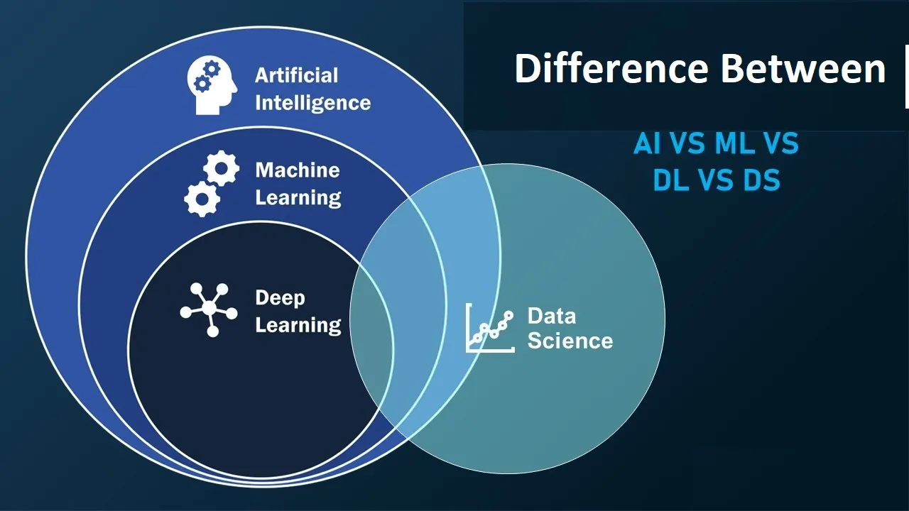
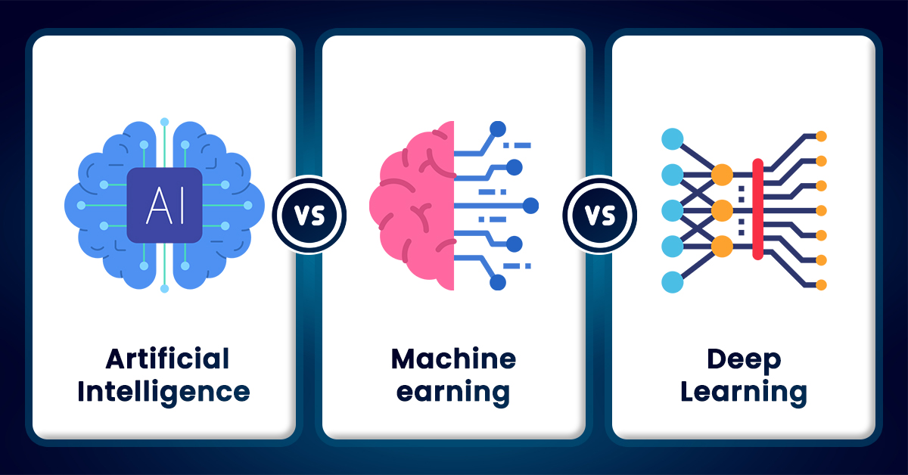

# 🧠 Deep Learning Fundamentals: AI, Machine Learning, and Deep Learning

Welcome to this educational repository! Here, you'll learn the essential concepts of **Artificial Intelligence (AI)**, **Machine Learning (ML)**, and **Deep Learning (DL)**.

By the end of this journey, you'll gain a clear understanding of deep neural networks, their mechanics, and their real-world applications.

---

## 🎯 Learning Goals

After exploring the material in this repository, you should be able to clearly explain the following core concepts:

1.  What are the key differences between **AI**, **Machine Learning**, and **Deep Learning**?
2.  How does deep learning differ from traditional machine learning methods?
3.  What is the distinction between a shallow (artificial) neural network and a deep neural network?
4.  How does a deep neural network work (explaining **Forward vs Backward Propagation**)?
5.  What are the most important libraries for machine learning and deep learning?
6.  What is **TensorFlow**, and how is it used?

---

## 1. AI vs. ML vs. DL: The Core Hierarchy

This section outlines the relationship between the three fields. **Deep Learning** is a subset of **Machine Learning**, which is itself a subset of **Artificial Intelligence**.


| Concept | Definition | Example |
| :--- | :--- | :--- |
| **Artificial Intelligence (AI)** | The broad field of creating machines that mimic human intelligence. | Chatbots that understand human conversation. |
| **Machine Learning (ML)** | A subset of AI where systems learn from data and improve over time without explicit, rule-based programming. | Email spam detection (learning patterns from examples). |
| **Deep Learning (DL)** | A subset of ML that uses **multi-layered neural networks** (deep networks) to automatically extract complex features. | Image recognition (e.g., self-driving cars detecting pedestrians). |

---

## 2. Feature Engineering: Traditional ML vs. Deep Learning

The primary difference lies in how features are handled: 

| Method | Feature Extraction | Analogy |
| :--- | :--- | :--- |
| **Traditional ML** (e.g., Decision Trees, SVM) | Requires **Manual Feature Extraction**. A human expert must define the relevant features (e.g., "edges" or "color intensity") for the model. | Following a precise recipe (every step must be defined). |
| **Deep Learning (DL)** | **Automatic Feature Learning**. The deep network learns and extracts the complex features directly from raw data (pixels, audio waveforms). | A chef who learns to cook through tasting and experience. |

---

## 3. Network Architecture: Shallow vs. Deep Neural Networks

The term "Deep" refers to the number of **hidden layers** in the network: 

* **Shallow Network (ANN):** Has only **one or two** hidden layers.
* **Deep Network (DNN):** Can contain **dozens or hundreds** of hidden layers.

The greater depth allows the model to learn **hierarchical patterns**, such as recognizing simple edges in the first layers, combining them into shapes in the middle layers, and finally identifying a full object in the final layers.

---

## 4. How Deep Networks Learn: Forward and Backward Propagation

Training a deep neural network involves a continuous loop of prediction and correction: 


### Forward Propagation
* **Action:** Data flows through the network from the **input layer** to the **output layer**.
* **Result:** The model makes an initial **prediction**.

### Backward Propagation (Backprop)
* **Action:** The calculated **error** (the difference between the prediction and the true value) is sent backward through the network.
* **Result:** The model adjusts its internal parameters (**weights and biases**) to reduce this error, improving accuracy for the next prediction cycle.

---

## 5. Essential ML & DL Libraries in Python 🐍

These are the most common Python libraries used in the ML/DL ecosystem:  
| Library | Primary Function |
| :--- | :--- |
| **NumPy** | Fundamental for numerical computations and array handling. |
| **Pandas** | Used for data manipulation and analysis. |
| **Scikit-learn** | Provides classical machine learning algorithms (e.g., Linear Regression, Clustering). |
| **TensorFlow** | A powerful deep learning and GPU computing framework. |
| **PyTorch** | A flexible deep learning framework known for dynamic computational graphs. |
| **Keras** | A high-level API for quickly building and training models, often running on top of TensorFlow. |

---

## 6. TensorFlow Overview


**TensorFlow** is an **open-source library** developed by Google for building and training **machine learning and deep learning** models.

* **Capabilities:** It supports fast numerical computation and is designed to run efficiently across various platforms, including **CPU, GPU**, and mobile devices.
* **Usage Example:** It can be used alongside Keras to define, compile, and fit complex neural network architectures for tasks like image classification with minimal code.

---

## 🚀 Getting Started

To get started with the examples and concepts in this repository, clone the repo and install the necessary dependencies:

```bash
# Clone the repository
git clone [YOUR-REPOSITORY-URL]
cd deep-learning-fundamentals

# Install key Python libraries
pip install numpy pandas scikit-learn tensorflow keras pytorch